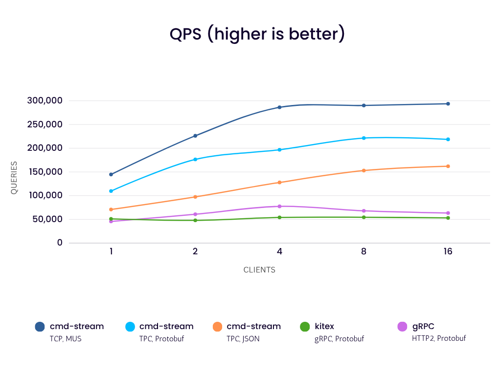
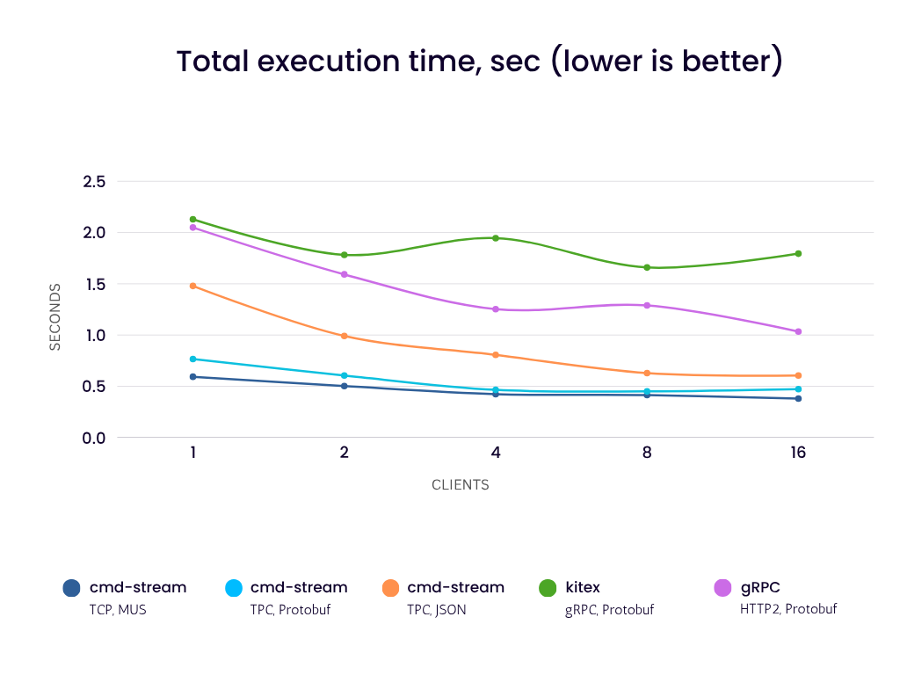
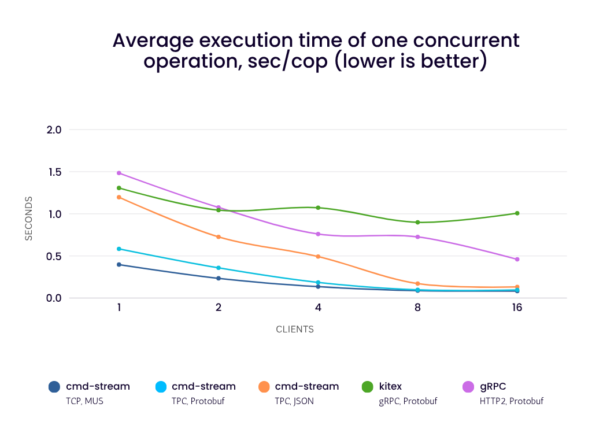
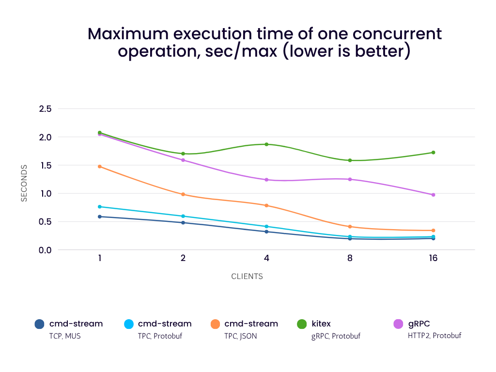
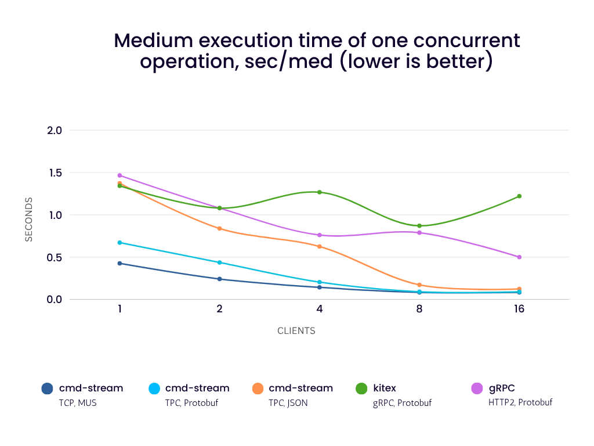
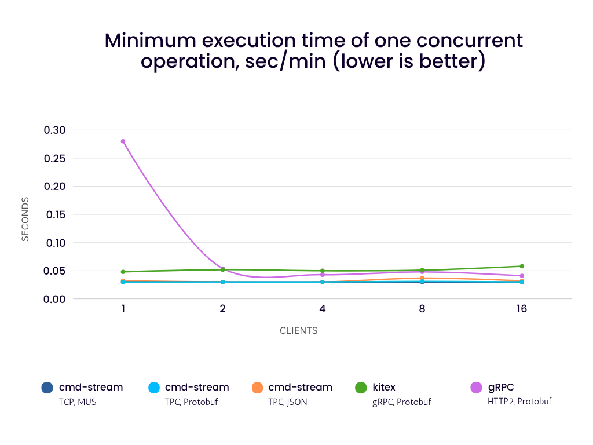
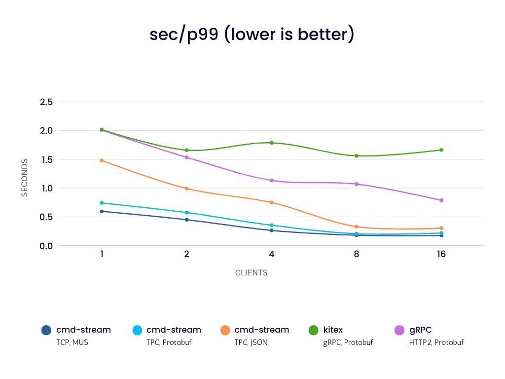
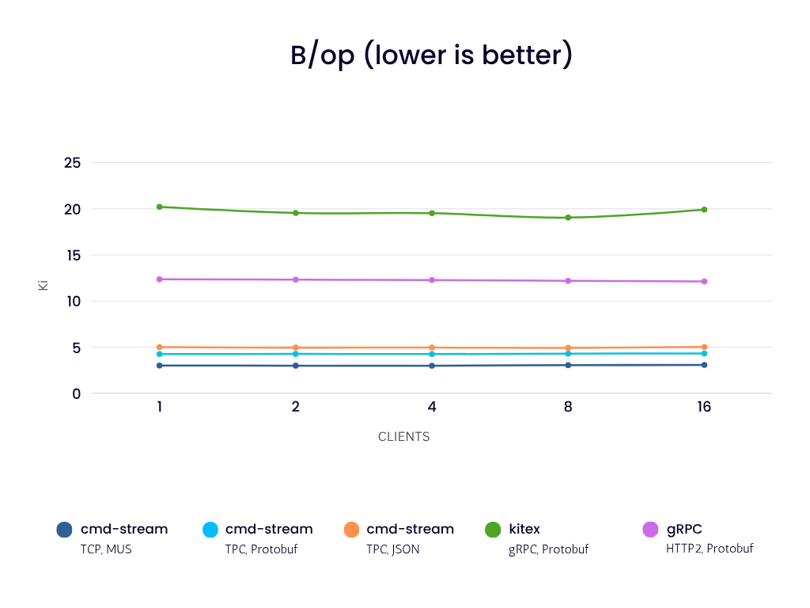
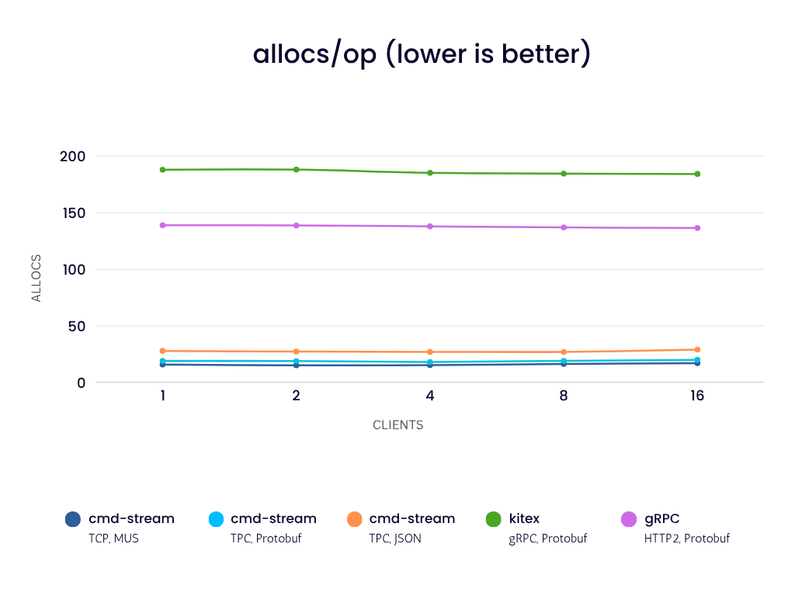

# go-client-server-benchmarks

This project compares the performance of several client-server communication
libraries and frameworks for Go.

## Tested libraries/frameworks

- [gRPC](https://pkg.go.dev/google.golang.org/grpc)
- [Kitex](https://github.com/cloudwego/kitex)
- [Connect](https://connectrpc.com/)
- [cmd-stream](https://github.com/cmd-stream/cmd-stream-go)
- [DRPC](https://github.com/drpcframework/drpc)

## Short Benchmarks Description

In this benchmarks 1,2,4,8,16 clients send echo requests to the server as
follows:

- Each client executes all echo requests simultaneously in separate goroutines.
- The same data is used for all participants, it is generated once and then
  used by everyone.
- Size of the data varies from 17 to 1024 bytes.
- The size of the read and write buffers is limited to 4096 bytes (except Connect).
- The delay of each response on the server is 30 ms.
- The received data is checked - it must match the sent data.

## Results

[Results](results) were obtained on a single laptop (with the connected charger 
and fan running at full speed):

- CPU: AMD Ryzen 7 PRO 5850U with Radeon Graphics
- OS: Debian 6.1.148-1 x86_64 GNU/Linux  
- Go: 1.24.1

using the following commands:

```bash
GEN_SIZE=400000 go test -bench BenchmarkQPS -count=10 -timeout=30m
go test -bench BenchmarkFixed -benchtime=100000x -benchmem -count=10
```

Only the top 5 fastest cases are shown below. Full results are available in
[qps.csv](results/qps/qps.csv).

### Head-of-Line Blocking

[Head-of-Line (HOL) blocking](https://en.wikipedia.org/wiki/Head-of-line_blocking) 
refers to the inability to send multiple concurrent requests over a single 
connection (i.e. you cannot send a new request until the one before it is 
finished). This behavior is characteristic of HTTP/1.1 and is precisely what 
HTTP/2 addresses via multiplexing.

The following participants are limited by HOL blocking:

- **DRPC**

In these benchmarks, they all will hit a "performance ceiling" of approximately 
33 iterations per connection ([results/qps/qps.csv](results/qps/qps.csv)) due to 
the 30ms server delay:

$$1s / 0.030s \approx 33 \text{ iterations}$$

### QPS Results



### Fixed Results

To get more comparable results, let's check how well all participants can
handle 100,000 simultaneous requests:









