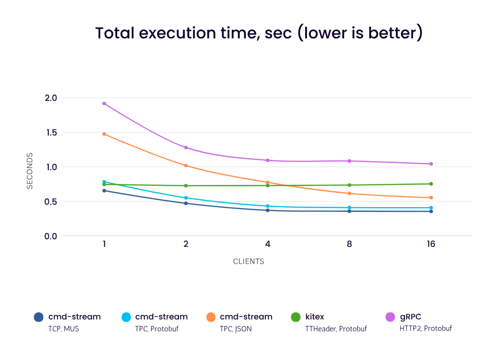
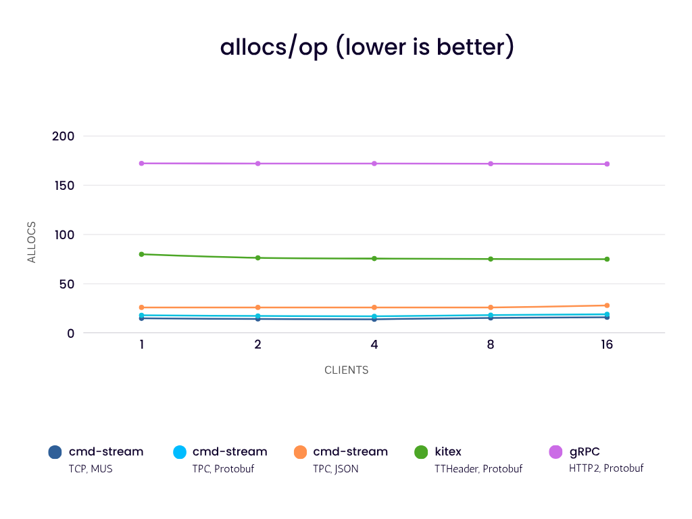

# go-client-server-benchmarks
This project compares the performance of several client-server communication 
libraries and frameworks for Go.

# Tested libraries/frameworks
- [google.golang.org/grpc](https://pkg.go.dev/google.golang.org/grpc)
- [github.com/cloudwego/kitex](https://github.com/cloudwego/kitex)
- [github.com/cmd-stream/cmd-stream-go](https://github.com/cmd-stream/cmd-stream-go)
- [net/http](https://pkg.go.dev/net/http)

# Short Benchmarks Description
In this benchmarks 1,2,4,8,16 clients send echo requests to the server as
follows:
- Each client uses only one connection and executes all echo requests
  simultaneously in separate goroutines.
- The same data is used for all participants, it is generated once and then 
  used by everyone.
- Size of the data varies from 17 to 1024 bytes.
- The size of the read and write buffers is limited to 4096 bytes.
- The delay of each response on the server is 30 ms.
- The received data is checked - it must match the sent data.

# Results
All [results](results) were obtained on a single laptop (with the connected 
charger and fan running at full speed):
- CPU: AMD Ryzen 7 PRO 5850U with Radeon Graphics
- OS: Gentoo 5.19.9-gentoo x86_64 GNU/Linux
- Go: 1.24.1

with the following commands:
```bash
GEN_SIZE=400000 go test -bench BenchmarkQPS -count=10 -timeout=30m
go test -bench BenchmarkFixed -benchtime=100000x -benchmem -count=10
```


To get more comparable results, let's check how well all participants can 
handle 100,000 simultaneous requests:





